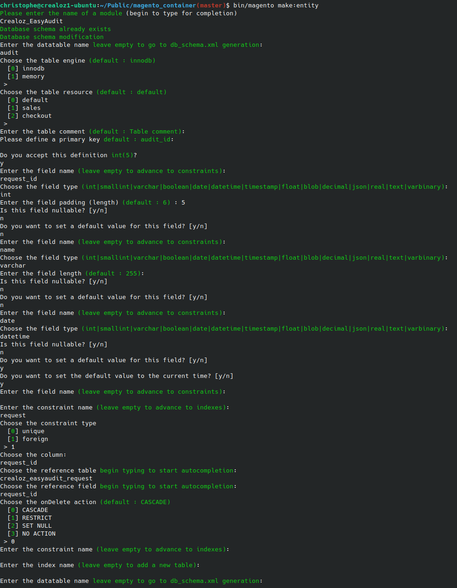

# Make entity

This command will generate a db_schema.xml file for a new table. In the future, it will also generate the model, resource
model, and collection.

## Command

```bash
bin/magento make:entity
```

You will then be prompted questions regarding the entity you want to create. You can have look at the example below:



## Result

The command will generate a db_schema.xml file in the `etc/` directory of your module or update existing one.

```xml
<?xml version="1.0"?>
<schema xmlns:xsi="http://www.w3.org/2001/XMLSchema-instance"
        xsi:noNamespaceSchemaLocation="urn:magento:framework:Setup/Declaration/Schema/etc/schema.xsd">
    <table name="crealoz_easyaudit_request" resource="default" engine="innodb" comment="Easy Audit Request Table">
        <column name="request_id" xsi:type="int" padding="10" unsigned="true" nullable="false" identity="true"
                comment="Entity ID"/>
        <column name="username" xsi:type="varchar" nullable="false" length="255" comment="User"/>
        <column name="execution_time" xsi:type="timestamp" nullable="true" on_update="false" comment="Execution Time"/>
        <column name="created_at" xsi:type="timestamp" nullable="false" on_update="false" default="CURRENT_TIMESTAMP"
                comment="Creation Time"/>
        <column name="request" xsi:type="text" nullable="true" comment="Request"/>
        <column name="filepath" xsi:type="varchar" nullable="true" length="255" comment="File Path"/>
        <constraint xsi:type="primary" referenceId="PRIMARY">
            <column name="request_id"/>
        </constraint>
    </table>
    <table name="audit" engine="innodb" resource="default" comment="Table comment">
        <column name="audit_id" padding="5" xsi:type="int" unsigned="true" nullable="false"/>
        <column name="request_id" xsi:type="int" padding="5" nullable=""/>
        <column name="name" xsi:type="varchar" length="255" nullable=""/>
        <column name="date" xsi:type="datetime" nullable="" default="CURRENT_TIMESTAMP"/>
        <index referenceId="name" indexType="fulltext">
            <column name="name"/>
        </index>
        <constraint xsi:type="primary" referenceId="PRIMARY">
            <column name="audit_id"/>
        </constraint>
        <constraint xsi:type="foreign" referenceId="AUDIT_REQUEST_ID_CREALOZ_EASYAUDIT_REQUEST_REQUEST_ID" table="audit"
                    column="request_id" referenceTable="crealoz_easyaudit_request" referenceColumn="request_id"
                    onDelete="CASCADE"/>
    </table>
</schema>
```

This example is based on https://github.com/crealoz/easy-audit-free/blob/master/etc/db_schema.xml

To get your database updated, you will need to run the following command:

```bash
bin/magento setup:upgrade
```

### Disclaimer

Please note that this command is still in development and may not work as expected.

